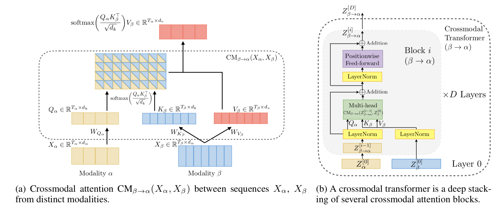

  

# Multimodal Transformer for Unaligned Multimodal Language Sequences

> Pytorch implementation for learning Multimodal Transformer for unaligned multimodal language sequences.

Correspondence to: 
  - Yao-Hung Hubert Tsai (yaohungt@cs.cmu.edu)
  - Shaojie Bai (shaojieb@andrew.cmu.edu)

## Paper
[**Multimodal Transformer for Unaligned Multimodal Language Sequences**](https://arxiv.org/pdf/1906.00295.pdf)<br>
[Yao-Hung Hubert Tsai](https://yaohungt.github.io) *, [Shaojie Bai](https://jerrybai1995.github.io) *, [Paul Pu Liang](http://www.cs.cmu.edu/~pliang/), [J. Zico Kolter](http://zicokolter.com), [Louis-Philippe Morency](https://www.cs.cmu.edu/~morency/), and [Ruslan Salakhutdinov](https://www.cs.cmu.edu/~rsalakhu/)<br>
Association for Computational Linguistics (ACL), 2019. (*equal contribution)

Please cite our paper if you find our work useful for your research:

```tex
@inproceedings{tsai2019MULT,
  title={Multimodal Transformer for Unaligned Multimodal Language Sequences},
  author={Tsai, Yao-Hung Hubert and Bai, Shaojie and Liang, Paul Pu and Kolter, J. Zico and Morency, Louis-Philippe and Salakhutdinov, Ruslan},
  booktitle={Proceedings of the 57th Annual Meeting of the Association for Computational Linguistics (Volume 1: Long Papers)},
  month = {7},
  year={2019},
  address = {Florence, Italy},
  publisher = {Association for Computational Linguistics},
}
```

## Overview

### Overall Architecture for Multimodal Transformer
<p align="center">


Multimodal Transformer (MulT) merges multimodal time-series via a feed-forward fusion process from multiple directional pairwise crossmodal transformers. Specifically, each crossmodal transformer serves to repeatedly reinforce a *target modality* with the low-level features from another *source modality* by learning the attention across the two modalities' features. A MulT architecture hence models all pairs of modalities with such crossmodal transformers, followed by sequence models (e.g., self-attention transformer) that predicts using the fused features.


### Crossmodal Attention for Two Sequences from Distinct Modalities 
<p align="center">

  
The core of our proposed model are crossmodal transformer and crossmodal attention module.   
  
## Usage

### Prerequisites
- Python 3.6/3.7
- [Pytorch (>=1.0.0) and torchvision](https://pytorch.org/)
- CUDA 10.0 or above

### Datasets

Data files (containing processed MOSI, MOSEI and IEMOCAP datasets) can be downloaded from [here](https://www.dropbox.com/sh/hyzpgx1hp9nj37s/AAB7FhBqJOFDw2hEyvv2ZXHxa?dl=0).
  
I personally used command line to download everything:
~~~~
wget https://www.dropbox.com/sh/hyzpgx1hp9nj37s/AADfY2s7gD_MkR76m03KS0K1a/Archive.zip?dl=1
mv 'Archive.zip?dl=1' Archive.zip
unzip Archive.zip
~~~~

To retrieve the meta information and the raw data, please refer to the [SDK for these datasets](https://github.com/A2Zadeh/CMU-MultimodalSDK).

### Run the Code

1. Create (empty) folders for data and pre-trained models:
~~~~
mkdir data pre_trained_models
~~~~

and put the downloaded data in 'data/'.

2. Command as follows
~~~~
python main.py [--FLAGS]
~~~~

Note that the defualt arguments are for unaligned version of MOSEI. For other datasets, please refer to Supplmentary.

### If Using CTC

Transformer requires no CTC module. However, as we describe in the paper, CTC module offers an alternative to applying other kinds of sequence models (e.g., recurrent architectures) to unaligned multimodal streams.

If you want to use the CTC module, plesase install warp-ctc from [here](https://github.com/baidu-research/warp-ctc).

The quick version:
~~~~
git clone https://github.com/SeanNaren/warp-ctc.git
cd warp-ctc
mkdir build; cd build
cmake ..
make
cd ../pytorch_binding
python setup.py install
export WARP_CTC_PATH=/home/xxx/warp-ctc/build
~~~~

### Acknowledgement
Some portion of the code were adapted from the [fairseq](https://github.com/pytorch/fairseq) repo.


